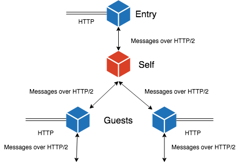

- 开始日期： 2016-03-08

# 概述

使用 DHT、 HTTP/2 等协议实现 Web 服务器之间的互相代理，进而支持可以访问其中任何一台 Web 服务器的浏览器都可直接访问位于其他 Web 服务器上的内容，大致原理如下：

# 目的

通过反向代理让数据回归客户端自身，去除**数据中心化**。

# 实现细节

基于现有的 HTTP 库，需要实现以下功能：

## P2P
不同于传统的 HTTP 反向代理只实现单向的代理，此特性需要支持双向的代理。任一节点收到请求后获得其请求的真实主机名，然后通过查询 DHT 获得主机信息，最后与其建立连接后自身充当代理的角色。将主机名到真实地址（ IP:PORT ）的路由信息存于 DHT 中这一过程需要定期不断地执行以保证最新。

## 公网代理
此特性允许其他节点将主机名映射到自己的地址，进而外来请求可以通过公网代理访问到内网的节点。而当节点处于内网中时需要与公网中至少一个节点保持 HTTP/2 长连接。

内网节点与公网节点之间的 HTTP/2 长连接通过如下方法建立：首先公网节点运行一个普通的 TCP 服务器，然后内网节点连接此 TCP 服务器，连接建立之后公网节点通过此连接发送 HTTP/2 请求，内网节点从该连接接收 HTTP/2 请求。

## DNS
为了可以直接使用浏览器访问代理的内容，需要实现一个去中心化的 DNS 服务，将 HTTP 请求定位到 DHT 中指向的地址，即从 DHT 中读取 DNS。

## 处理外部 HTTP 客户端请求
此特性与传统 Web 服务器处理请求的方法一致。

# 类似的设计
[pangolin](https://github.com/qgy18/pangolin) 实现了一个很简单的 HTTP/2 反向代理，仅包括公网代理的功能。

# 未解决的问题
## 主机名的安全性问题
主机名缺乏所有权，存在被冒用的问题，将来可以考虑使用区块链技术解决。