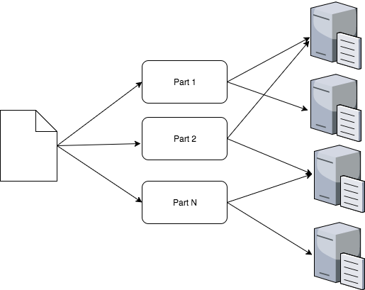

- 开始日期： 2017-12-10

# 概述

将目标文件切分成多个部分，然后通过 Psychokinesis 网络存储至多个节点上，最终实现文件备份于分散的多个节点上，网络中超过一定比例的节点在线即可获取到完整的文件。如下图所示：

# 目的

通过文件切分存储让数据回归客户端自身，去除**数据中心化**。

# 实现细节

## 文件切分
将文件分成多份以便于传输与存储。

## 文件备份
文件分片会被分散存储于多个节点上，同一个文件分片会被不同的 M 个节点存储（文件备份次数为 M），假设网络中共有 T 个节点，那么当网络中至少有 T - M + 1 个节点时文件就保证能够完整获取到。可以通过提升 M 值来加大文件获取成功的概率。

# 类似的设计
[ipfs](https://github.com/ipfs/ipfs) 去中心化的网络文件系统。

# 未解决的问题
## 元数据存储去中心化
目前文件与节点的对应元数据信息存储于普通的数据库中，未来需要考虑类似区块链的存储方法。